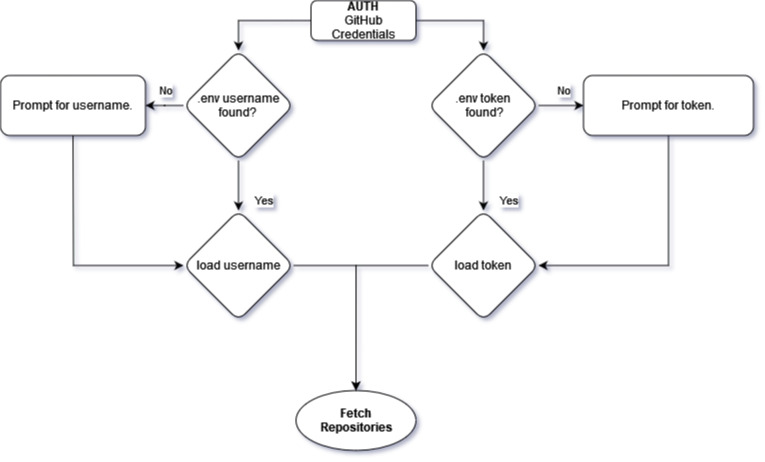

# BryonS-project0

**Revature DevOps Project0 -Python Application 2206-devops-batch**
**Instructor Nick E.**

## GitHub Snapshot

### Dependencies

- python-dotenv 0.20.0
<!-- - requests 2.28.0 -->

### Instructions

- Clone repository
- Install dependencies
  - python3 -m pip3 install python-dotenv requests
- Create .env file in root directory
  - USER=your_github_username
  - TOKEN=your_github_token
    - The token can be created from: Settings / Developer Settings / Personal access tokens
- Run: 'python main.py' from the terminal

### Purpose

Create a backup of all your Github repositories. Compare changed repositories with a database of last snapshot data and only download changed or new repositories.

1. First time run -get all repositories.
2. Second time run -only get changed or new repositories.

### Start logic to create the directory and database file

### Auth logic for GitHub username and token

### Download logic for new or changed repositories

